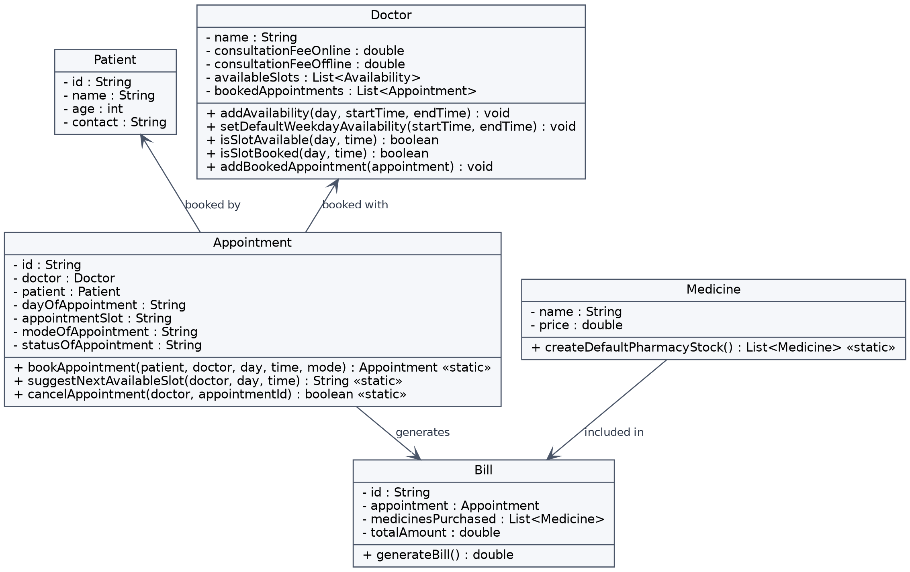

# Clinic Management System (Java LLD Project)


A simple Low-Level Design (LLD) project built in **pure Java**, simulating a single-doctor clinic that manages patient appointments (online/offline), doctor availability, and billing (consultation + pharmacy medicines).

This project was built step-by-step as a self-learning exercise in Object-Oriented Design, following the same structured approach used in real LLD interview problems: Description → Assumptions → Rules → Example I/O → Class Diagram → Code.

---

## Description

Design a single-doctor clinic system where:
- Patients can book appointments (Online or Offline)
- The doctor has fixed weekly availability
- Booking conflicts are automatically resolved by suggesting the next available slot
- Billing is generated by combining the consultation fee with any pharmacy medicines purchased

---

## Problem Assumptions

**Doctor & Availability**
- The clinic has a single doctor
- Doctor is available Monday to Friday, 09:00–13:00
- Clinic is closed on Saturday and Sunday
- Appointment slot duration is 15 minutes

**Charges**
1. Consultation Fee for Online appointment: Rs. 300 per patient
2. Consultation Fee for Offline appointment: Rs. 500 per patient
3. Pharmacy medicines are sold at fixed pre-set prices (no stock tracking, no discounts, no price updates)

**Booking Rules**
1. A patient requests an appointment for a specific day, time, and mode (Online/Offline)
2. If the requested slot falls within the doctor's availability **and** is not already booked → the appointment is confirmed at that time
3. If the requested slot is already booked → the system automatically checks forward in 15-minute increments and books the next available slot instead (status: Auto-Confirmed)
4. If the requested day/time falls entirely outside the doctor's working hours → the booking is rejected
5. Appointments can be cancelled using their Appointment ID

**Pharmacy**
- The clinic maintains a fixed list of 6 medicines with pre-set prices (no stock tracking)
- A patient can optionally purchase any of these during their visit
- Total Bill = Consultation Fee + Sum of selected medicine prices

---

## Example Input / Output

**Example 1 — Slot Available (Confirmed)**
```
Input: Patient ID: 1, Name: XXX, Age: 60, Day: Monday, Slot: 10:00 AM, Mode: Offline
Output: Doctor available 9AM-1PM on Monday. Slot is free.
        Appointment ID: A1, Status: Confirmed
```

**Example 2 — Slot Conflict (Auto-Suggested)**
```
Input: Patient ID: 2, Name: YYY, Age: 35, Day: Monday, Slot: 10:00 AM, Mode: Online
Output: Doctor available 9AM-1PM on Monday. Slot 10:00 AM is not free.
        Next available slot found: 10:15 AM. Booking auto-confirmed.
        Appointment ID: A2, Status: Auto-Confirmed
```

**Example 3 — Outside Working Hours (Rejected)**
```
Input: Patient ID: 3, Name: ZZZ, Age: 28, Day: Sunday, Slot: 12:00 PM, Mode: Offline
Output: Doctor not available at this day/time. Booking rejected.
```

**Example 4 — Billing with Pharmacy**
```
Input: Patient buys Paracetamol (Rs.20) + Cough Syrup (Rs.60) along with an Offline consultation
Output: Total = 500 + 20 + 60 = Rs.580
```

---

## Class Diagram



**Classes:** `Patient`, `Doctor`, `Availability`, `Appointment`, `Medicine`, `Bill`

**Key Relationships:**
- `Appointment` references one `Patient` and one `Doctor`
- `Bill` references one `Appointment` and a list of `Medicine`

**Design Patterns Used:**
- Static utility-style methods on `Appointment` (`bookAppointment`, `suggestNextAvailableSlot`, `cancelAppointment`) — booking logic operates independently of any single instance
- Encapsulation across all model classes (private fields with public getters/setters)

---

## Project Structure

```
clinic-management-system/
 ├── src
 │    └── com.clinic
 │         ├── models
 │         │    ├── Appointment.java
 │         │    ├── Availability.java
 │         │    ├── Bill.java
 │         │    ├── Doctor.java
 │         │    ├── Medicine.java
 │         │    └── Patient.java
 │         └── ClinicApp.java   (entry point / demo driver)
 ├── clinic-class-diagram.png
 ├── README.md
 └── .gitignore
```

---

## Core Methods

| Class | Method | Description |
|---|---|---|
| `Doctor` | `isSlotAvailable(day, time)` | Checks if a day/time falls within the doctor's working hours |
| `Doctor` | `isSlotBooked(day, time)` | Checks if a slot is already taken by another appointment |
| `Doctor` | `setDefaultWeekdayAvailability(start, end)` | Adds the same availability window for Monday–Friday |
| `Appointment` | `bookAppointment(...)` | Validates and books an appointment, auto-suggesting the next slot on conflict |
| `Appointment` | `suggestNextAvailableSlot(...)` | Finds the next free 15-minute slot on a given day |
| `Appointment` | `cancelAppointment(...)` | Removes an appointment by ID |
| `Medicine` | `createDefaultPharmacyStock()` | Returns the clinic's fixed list of 6 medicines |
| `Bill` | `generateBill()` | Calculates total = consultation fee + sum of medicine prices |

---

## How to Run

1. Clone the repository
   ```
   git clone <repo-url>
   ```
2. Open the project in IntelliJ IDEA (or any Java IDE)
3. Run `ClinicApp.java`
4. Follow the on-screen prompts to enter patient details and book an appointment

**Requirements:** Java 8 or above (built and tested on JDK 21)

---

## Sample Run

```
Enter Patient ID: P001
Enter Patient Name: XXX
Enter Patient Age: 65
Enter Patient Contact: +91 9444645421

Enter Appointment Day (e.g., Monday): Monday
Enter Appointment Time (HH:mm): 11:00
Enter Mode (Online/Offline): Online

Your Appointment: Appointment ID: A001
Status: Confirmed
```

The demo also includes hardcoded scenarios showing:
- Slot conflict + auto-suggestion
- Booking rejection outside working hours
- Multi-patient conflict handling
- Appointment cancellation
- Bill generation with pharmacy medicines

---

## Possible Future Enhancements

- Persist data using a database instead of in-memory storage
- Support multiple doctors
- Add stock tracking for pharmacy medicines
- Add JUnit test coverage for all service methods
- Replace static methods with a dedicated `AppointmentService` / `BillingService` layer

---

## Author

Built as a self-directed Low-Level Design learning project — from requirements documentation through to a fully working, tested Java implementation.
